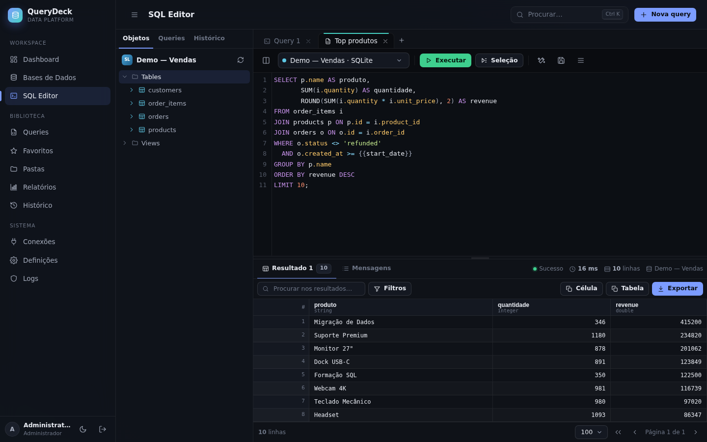
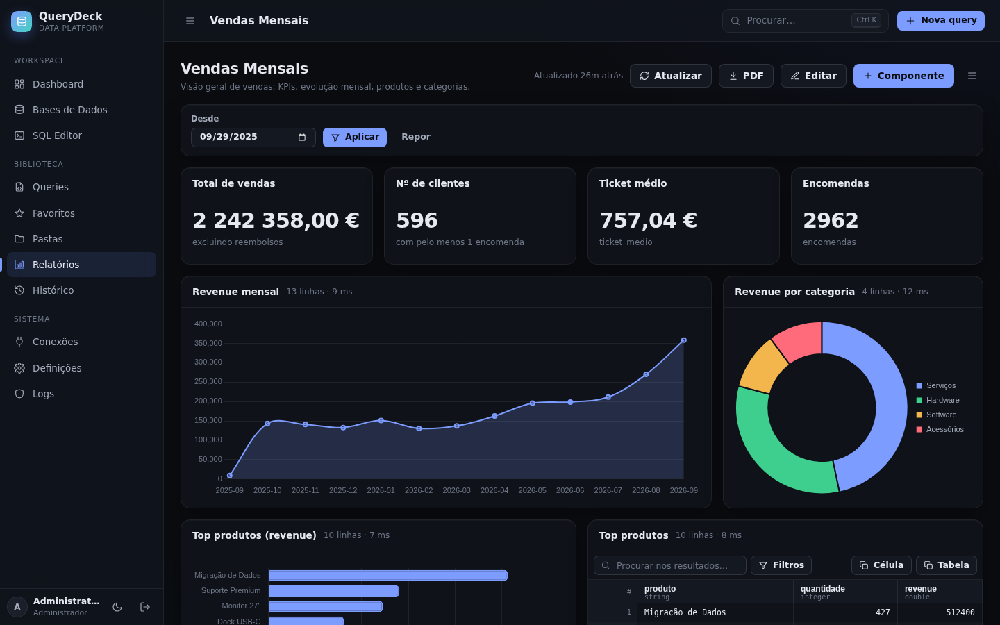
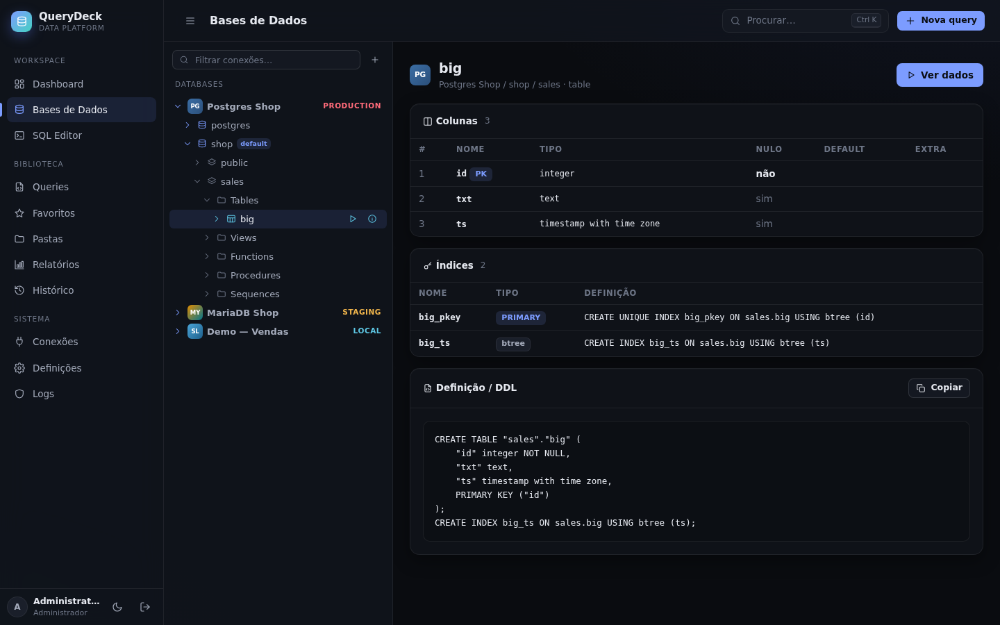
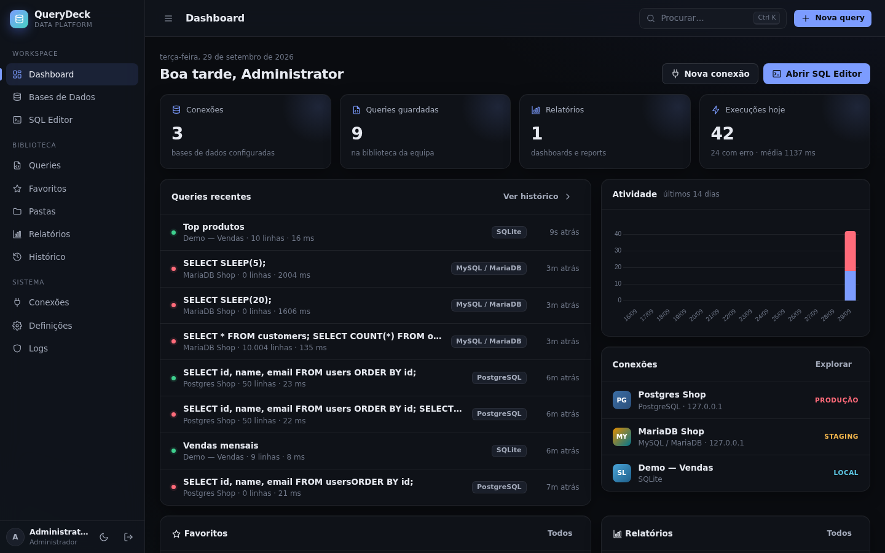

# QueryDeck — Database Management & Reporting Platform

Aplicação web para gerir ligações a várias bases de dados, escrever e executar SQL, guardar e organizar
queries, exportar resultados e transformar queries em relatórios/dashboards. Inspirada no pgAdmin e no
SQL Server Management Studio, com uma interface moderna, *dark-first*, pensada para quem trabalha
diariamente com dados.



| Relatório | Explorer | Dashboard |
|---|---|---|
|  |  |  |

---

## Índice

1. [Funcionalidades](#1-funcionalidades)
2. [Stack e decisões técnicas](#2-stack-e-decisões-técnicas)
3. [Requisitos](#3-requisitos)
4. [Instalação rápida (desenvolvimento)](#4-instalação-rápida-desenvolvimento)
5. [Instalação em produção](#5-instalação-em-produção)
6. [Docker](#6-docker)
7. [Configuração (.env)](#7-configuração-env)
8. [Configurar as bases de dados externas](#8-configurar-as-bases-de-dados-externas)
9. [Utilização](#9-utilização) · [Assistente IA (Open WebUI)](#assistente-ia-open-webui--ollama--lm-studio)
10. [Arquitetura](#10-arquitetura)
11. [Segurança](#11-segurança)
12. [Performance e grandes volumes](#12-performance-e-grandes-volumes)
13. [Limitações face ao pgAdmin / SSMS](#13-limitações-face-ao-pgadmin--ssms)
14. [Testes](#14-testes)
15. [Roadmap](#15-roadmap)

---

## 1. Funcionalidades

### Implementado (v1.0)

| Área | O que existe |
|---|---|
| **Autenticação** | Login com email/password (Argon2id), conta inicial definida no `.env`, bloqueio após tentativas falhadas, timeout de sessão, logout, alteração de password. |
| **Dashboard** | Cards clicáveis (conexões, queries, relatórios, execuções do dia), queries recentes, gráfico de atividade (14 dias), favoritos, conexões e relatórios. |
| **Conexões** | PostgreSQL, MySQL/MariaDB, SQL Server, SQLite. Nome, host, porta, database, utilizador, password, SSL/opções por tipo, ambiente (produção/staging/dev/local), cor, modo só-leitura. **Testar conexão** antes de guardar. Passwords encriptadas, nunca enviadas ao browser. |
| **Explorer** | Árvore *lazy* estilo pgAdmin/SSMS: Databases → Schemas → Tables / Views / Functions / Procedures / Sequences → Columns / Indexes. Painel de detalhe com colunas, índices, foreign keys e DDL/definição. "Ver dados" abre o editor com `SELECT … LIMIT 100`. |
| **SQL Editor** | CodeMirror com syntax highlighting por dialeto, numeração de linhas, indentação automática, fecho de parênteses, **autocomplete** de tabelas/colunas/keywords, formatação SQL, múltiplas **tabs** (persistidas), seletor de conexão **e de database**, executar tudo / **executar seleção** (ou o statement onde está o cursor), **cancelar**, Explain, parâmetros `{{nome}}`, atalhos de teclado, painel lateral com objetos, queries guardadas e histórico. |
| **Resultados** | Vários result sets por execução (um separador por statement), separador de mensagens (linhas afetadas, tempos), nº de linhas, tempo, conexão, **paginação, ordenação, pesquisa e filtros por coluna no servidor**, copiar célula (Ctrl+C) / copiar tabela (TSV → Excel), ver valor completo (duplo clique, JSON formatado). |
| **Erros SQL** | Código/SQLSTATE, mensagem, **linha e coluna** (quando o motor as fornece), query correspondente e destaque da linha no editor. |
| **Exportação** | CSV (separador, cabeçalho, BOM, proteção contra *formula injection*), **XLSX** nativo, JSON, SQL `INSERT`s (dialeto da conexão), PDF, Markdown. "Todas as linhas" (re-executa em modo leitura, **streaming** sem limite) ou "vista atual" (com filtros/ordenação). Clipboard. |
| **Queries guardadas** | Nome, descrição, SQL, conexão, tags, pasta, criador, datas, nº de execuções. Criar, editar, duplicar, eliminar, favoritar, pesquisar, filtrar (pasta, conexão, tag), ordenar, executar diretamente, abrir no editor. |
| **Pastas** | Pastas encadeadas com cor; mover queries entre pastas. |
| **Histórico** | Cada execução: utilizador, data/hora, SQL, conexão/database, tempo, nº de linhas, estado (sucesso/erro/cancelada). Filtros, pesquisa, reabrir no editor. Admins veem o histórico de todos. |
| **Análises** | Análises parametrizadas com formulário: **funções PostgreSQL** importadas automaticamente (parâmetros, tipos e `DEFAULT` lidos da assinatura; campos vazios usam o valor por omissão da função) ou **queries SQL** com `{{parametros}}` e blocos opcionais `[[ ... ]]`. Execução só-leitura, tabela com pesquisa/filtros e download direto em **Excel** e **CSV** (`;`, vírgula decimal, UTF-8 para Excel PT). |
| **Relatórios** | Criados do zero ou a partir de uma query guardada. Componentes: **KPI/card, tabela, barras (vertical/horizontal, empilhadas), linhas, área, pie, doughnut, texto** e **filtros** do relatório (texto, número, data, lista) ligados a `{{parametros}}` no SQL. Larguras em grelha de 12 colunas, *drag & drop*, duplicar, imprimir/PDF. |
| **Utilizadores** | Perfis Administrador, Editor e Só leitura; gestão de utilizadores pelos admins. Estrutura de *roles*, *permissions* e acesso por conexão já criada na BD. |
| **Definições** | Tema (escuro/claro/sistema), tamanho da fonte do editor, linhas por página, autocomplete, confirmações de segurança, perfil, password, limites, drivers disponíveis. |
| **Logs** | Auditoria de login/falhas, conexões (criar/editar/eliminar/testar), queries, relatórios, exportações, utilizadores. |
| **Assistente IA** | Perguntas em linguagem natural ("qual a pessoa que mais faturou?") respondidas com a sua IA local (Open WebUI, Ollama, LM Studio…): gera o SQL a partir do esquema, executa **em só-leitura**, corrige erros automaticamente e responde em português, com o SQL e a tabela de resultados (exportável). Modo "rever SQL antes de executar", perguntas de seguimento e botão **IA** (Ctrl+I) no editor. |
| **Design** | Dark mode por defeito + light mode, glassmorphism subtil, sidebar recolhível, paleta de comandos (**Ctrl+K**), animações suaves, responsivo (mobile). |

---

## 2. Stack e decisões técnicas

* **Backend: PHP 8.1+ sem framework e sem dependências Composer obrigatórias.** Pequeno núcleo próprio
  (router, request/response, views, sessão, CSRF, validação) organizado em **módulos**. Motivos: instalação
  trivial em qualquer alojamento PHP (incluindo servidores internos sem acesso a Packagist), superfície de
  ataque mínima e código fácil de auditar. A estrutura (controllers/repositories/services por módulo) permite
  migrar para Laravel/Symfony no futuro sem reescrever a lógica de domínio.
* **Base de dados da aplicação:** MySQL/MariaDB (recomendado em produção) ou SQLite (desenvolvimento/equipas pequenas).
* **Acesso às BDs externas:** PDO, através de uma **camada de drivers** (`App\Modules\Drivers`).
* **Frontend:** HTML5 + CSS3 (design system próprio com tokens) + JavaScript *vanilla* com `fetch`.
  Bibliotecas incluídas localmente em `public/assets/vendor` (sem CDN — funciona em redes isoladas):
  * [CodeMirror 5](https://codemirror.net/5/) — editor SQL (MIT)
  * [Chart.js 4](https://www.chartjs.org/) — gráficos (MIT)
  * [sql-formatter](https://github.com/sql-formatter-org/sql-formatter) — formatação SQL (MIT)
* **Exportação XLSX e PDF** implementadas em PHP puro (streaming), sem bibliotecas externas.

---

## 3. Requisitos

* PHP **8.1+** (testado em 8.4) com extensões: `pdo`, `mbstring`, `json`, `sodium`, `zip`
  (e `intl` opcional para datas localizadas).
* Extensões por tipo de base de dados:

| Base de dados | Extensão PHP | Notas |
|---|---|---|
| MySQL / MariaDB | `pdo_mysql` | também usada para a BD da aplicação |
| PostgreSQL | `pdo_pgsql` | |
| SQL Server / Azure SQL | `pdo_sqlsrv` (recomendado) ou `pdo_dblib` (FreeTDS) | ver [secção 8.3](#83-sql-server) |
| SQLite | `pdo_sqlite` | |

* MySQL 5.7+/8.x ou MariaDB 10.3+ para a BD da aplicação (ou SQLite).
* Servidor web: Apache (mod_rewrite) ou nginx + PHP-FPM. Para desenvolvimento basta o servidor embutido do PHP.

Verificar extensões: `php -m | grep -i -E "pdo|sodium|zip|mbstring"`.

---

## 4. Instalação rápida (desenvolvimento)

```bash
git clone <repo> querydeck && cd querydeck
cp .env.example .env
# Para começar sem MySQL, use SQLite para a BD da aplicação:
#   APP_DB_DRIVER=sqlite
php bin/console install        # gera APP_KEY, cria as tabelas, cria o utilizador de teste e dados de demo
php bin/console serve          # http://localhost:8080
```

Entrar com as credenciais de `TEST_USER_EMAIL` / `TEST_USER_PASSWORD` do `.env`
(por omissão `admin@example.com` / `change-me` — **altere-as**).

A instalação cria uma conexão de demonstração **"Demo — Vendas"** (SQLite com clientes, produtos e
encomendas), 8 queries em 3 pastas e o relatório **"Vendas Mensais"**. Para não criar dados de demo defina
`SEED_DEMO=false` antes de `install`.

> `php bin/console serve` usa o servidor embutido do PHP com 4 *workers* (necessário para que o botão
> **Cancelar** funcione enquanto uma query corre). Não use em produção.

### Comandos disponíveis

```text
php bin/console install                  .env, APP_KEY, migrations e seed (idempotente)
php bin/console key:generate [--force]   gera APP_KEY (--force invalida as passwords guardadas!)
php bin/console migrate                  aplica migrations pendentes na BD da aplicação
php bin/console db:seed                  cria o utilizador de teste (+ demo se não houver conexões)
php bin/console user:create <email> <password> [admin|editor|readonly] [nome]
php bin/console history:prune            apaga histórico com mais de HISTORY_RETENTION_DAYS
php bin/console cache:clear [--expired]  limpa resultados em cache
php bin/console serve [porta] [workers]  servidor de desenvolvimento
```

---

## 5. Instalação em produção

1. **Código** em, por exemplo, `/var/www/querydeck` (o *DocumentRoot* deve ser **`public/`**).
2. **BD da aplicação (MySQL/MariaDB):**
   ```sql
   CREATE DATABASE querydeck CHARACTER SET utf8mb4 COLLATE utf8mb4_unicode_ci;
   CREATE USER 'querydeck'@'localhost' IDENTIFIED BY 'uma-password-forte';
   GRANT ALL PRIVILEGES ON querydeck.* TO 'querydeck'@'localhost';
   ```
3. **Configuração:**
   ```bash
   cp .env.example .env
   # editar: APP_ENV=production, APP_DEBUG=false, APP_URL, APP_DB_*, TEST_USER_*
   php bin/console install
   ```
   Guarde uma cópia segura do `APP_KEY`: sem ele as passwords das conexões não podem ser desencriptadas.
4. **Permissões:** o utilizador do servidor web precisa de escrita apenas em `storage/`:
   ```bash
   chown -R www-data:www-data storage && chmod -R 770 storage
   chmod 640 .env && chown root:www-data .env
   ```
5. **Servidor web:** exemplos prontos em `deploy/apache/querydeck.conf` e `deploy/nginx/querydeck.conf`
   (timeouts longos para queries e `fastcgi_buffering off` para exportações em streaming).
   Em alojamento partilhado onde não é possível apontar para `public/`, o `.htaccess` da raiz redireciona tudo
   para `public/` e o `storage/.htaccess` nega acesso direto.
6. **HTTPS** obrigatório em produção (o cookie de sessão fica `Secure` automaticamente e é enviado HSTS).
7. **Cron** (`deploy/crontab`): limpeza do histórico antigo e da cache de resultados.
8. **PHP:** `memory_limit` 256–512M, `opcache` ativo; `max_execution_time` pode ficar alto (o limite real é o
   `QUERY_TIMEOUT_SECONDS`, aplicado a cada statement no servidor de BD). Ver `deploy/docker/php.ini`.

Atualizações: `git pull && php bin/console migrate`.

---

### XAMPP (teste local no Windows)

1. Copiar a pasta do projeto para `C:\xampp\htdocs\querydeck`.
2. Em `C:\xampp\php\php.ini` confirmar que estão ativas (sem `;`): `extension=sodium`, `extension=zip`,
   `extension=intl`, `extension=curl`, `extension=mbstring`, `extension=pdo_mysql`, `extension=pdo_sqlite`
   (e `extension=pdo_pgsql` se usar PostgreSQL). Reiniciar o Apache no XAMPP Control Panel.
3. No *Shell* do XAMPP Control Panel:
   ```bat
   cd C:\xampp\htdocs\querydeck
   copy .env.example .env
   php bin/console install
   ```
   Antes do `install`, no `.env`, ou `APP_DB_DRIVER=sqlite`, ou use o MariaDB do XAMPP:
   crie a BD `querydeck` no phpMyAdmin e defina `APP_DB_USERNAME=root` / `APP_DB_PASSWORD=` (vazio por omissão no XAMPP).
4. Abrir `http://localhost/querydeck/` (o `.htaccess` da raiz encaminha tudo para `public/`).

### Windows / Windows Server

1. **PHP:** descarregar o PHP 8.3 **x64 Non Thread Safe** (zip) de <https://windows.php.net/download/>,
   extrair para `C:\php` e adicionar `C:\php` ao `PATH`. Pode ser preciso o
   [Visual C++ Redistributable](https://aka.ms/vs/17/release/vc_redist.x64.exe).
2. Copiar `C:\php\php.ini-production` para `C:\php\php.ini` e ativar (tirar o `;`):
   ```ini
   extension_dir = "ext"
   extension=curl
   extension=fileinfo
   extension=intl
   extension=mbstring
   extension=openssl
   extension=pdo_mysql
   extension=pdo_pgsql
   extension=pdo_sqlite
   extension=sodium
   extension=sqlite3
   extension=zip
   ```
   Confirmar com `php -m`. Para SQL Server instale os drivers
   [Microsoft Drivers for PHP for SQL Server](https://learn.microsoft.com/sql/connect/php/download-drivers-php-sql-server)
   (`php_pdo_sqlsrv_83_nts_x64.dll` em `C:\php\ext` + `extension=pdo_sqlsrv_83_nts_x64`) e o ODBC Driver 18.
3. **Código:** `git clone -b <branch> https://github.com/RicaroSilva/querrywebsite.git C:\querydeck`
   (ou *Code → Download ZIP* no GitHub, escolhendo o branch certo).
4. No PowerShell, em `C:\querydeck`:
   ```powershell
   copy .env.example .env
   notepad .env        # para testar: APP_DB_DRIVER=sqlite
   php bin/console install
   php bin/console serve 8090
   ```
   Abrir `http://localhost:8090`. No Windows o servidor de desenvolvimento do PHP atende **um pedido de cada
   vez** (o botão *Cancelar* só responde quando a query termina) — é só para testes.
5. **Produção em IIS:** instalar IIS com **CGI** e o módulo **URL Rewrite**, registar o PHP como FastCGI
   (`C:\php\php-cgi.exe`, *Handler Mappings* → `*.php`), criar um site com o caminho físico
   **`C:\querydeck\public`** (inclui `web.config`) e dar à conta do *Application Pool* permissão de escrita em
   `C:\querydeck\storage`. Aumentar em *FastCGI Settings* o *Activity/Request Timeout* (ex.: 600 s) para
   queries longas. Alternativa: Apache para Windows (Apache Lounge) com `deploy/apache/querydeck.conf`.

## 6. Docker

```bash
export APP_KEY=$(docker run --rm php:8.3-cli php -r 'echo "base64:".base64_encode(random_bytes(32));')
export DB_PASSWORD='password-forte' TEST_USER_PASSWORD='outra-password'
docker compose up -d --build        # http://localhost:8080
```

* `Dockerfile`: PHP 8.3 + Apache com `pdo_mysql`, `pdo_pgsql`, `pdo_sqlite`, `zip`, `intl`, `opcache`.
  Para SQL Server: `docker compose build --build-arg WITH_SQLSRV=1` (instala o ODBC Driver 18 da Microsoft e `pdo_sqlsrv`).
* `docker-compose.yml`: aplicação + MariaDB 11, volumes para `storage/` e dados da BD.
* O *entrypoint* espera pela BD e corre `migrate` + `db:seed` em cada arranque (idempotente).
* Variáveis de ambiente reais têm prioridade sobre o ficheiro `.env`.

---

## 7. Configuração (.env)

| Variável | Omissão | Descrição |
|---|---|---|
| `APP_NAME` | QueryDeck | Nome mostrado na interface |
| `APP_ENV` | production | `production` ou `development` |
| `APP_DEBUG` | false | Mostra detalhes de erros (nunca em produção) |
| `APP_URL` | | URL pública |
| `APP_TIMEZONE` | Europe/Lisbon | Fuso horário |
| `APP_KEY` | | Chave de 32 bytes (base64) para encriptar credenciais — `php bin/console key:generate` |
| `APP_DB_DRIVER` | mysql | `mysql` ou `sqlite` — **BD da própria aplicação** |
| `APP_DB_HOST/PORT/DATABASE/USERNAME/PASSWORD` | | Ligação MySQL/MariaDB da aplicação |
| `APP_DB_SQLITE_PATH` | storage/sqlite/querydeck.sqlite | Ficheiro quando `APP_DB_DRIVER=sqlite` |
| `TEST_USER_NAME/EMAIL/PASSWORD` | | Conta inicial (admin) criada por `db:seed` |
| `SESSION_NAME` | querydeck_sid | Nome do cookie |
| `SESSION_LIFETIME` | 7200 | Timeout de inatividade (s) |
| `SESSION_SECURE_COOKIE` | auto | `auto` usa `Secure` quando o pedido é HTTPS |
| `LOGIN_MAX_ATTEMPTS` / `LOGIN_LOCKOUT_SECONDS` | 5 / 900 | Proteção contra força bruta (por email + IP) |
| `QUERY_TIMEOUT_SECONDS` | 60 | Timeout de cada statement nas BDs externas |
| `QUERY_MAX_ROWS` | 10000 | Máximo de linhas guardadas por result set para navegação |
| `QUERY_PAGE_SIZE` | 100 | Linhas por página na grelha |
| `EXPORT_MAX_ROWS` | 0 | Limite de exportação (0 = ilimitado, em streaming) |
| `RESULT_CACHE_TTL` | 3600 | Validade da cache de resultados no servidor (s) |
| `HISTORY_RETENTION_DAYS` | 180 | Usado por `history:prune` |
| `SQLITE_ALLOWED_DIRS` | storage/sqlite | Pastas (separadas por vírgula) onde podem estar ficheiros SQLite ligáveis |
| `SEED_DEMO` | true | Criar dados de demonstração na instalação |
| `AI_ENABLED` | false | Ativa o Assistente IA |
| `AI_BASE_URL` | http://localhost:3000/api | API compatível com OpenAI (Open WebUI: `…/api`; Ollama: `…:11434/v1`) |
| `AI_API_KEY` / `AI_MODEL` | | Chave (Open WebUI) e id do modelo |
| `AI_TIMEOUT_SECONDS` / `AI_TEMPERATURE` | 120 / 0.1 | Timeout de cada pedido à IA e temperatura |
| `AI_MAX_ATTEMPTS` | 3 | Tentativas (correção automática de SQL com erro) |
| `AI_SEND_RESULTS` / `AI_RESULT_ROWS` | true / 50 | Enviar linhas do resultado ao modelo para escrever a resposta |
| `AI_QUERY_MAX_ROWS` | 1000 | Máximo de linhas das queries da IA |
| `AI_SCHEMA_MAX_CHARS` | 30000 | Acima disto a IA escolhe primeiro as tabelas relevantes |
| `AI_NUM_CTX` | | Janela de contexto a pedir ao Ollama (ex.: 32768) |

---

## 8. Configurar as bases de dados externas

Conexões são criadas em **Conexões → Nova conexão** (ou no seletor do editor). Use **Testar conexão**
antes de guardar. Recomenda-se **um utilizador de BD dedicado ao QueryDeck** com o mínimo de privilégios;
para conexões de consulta, um utilizador **só de leitura** e a opção *Modo só de leitura* ativa.

### 8.1 PostgreSQL

* Campos: host, porta (5432), database (a inicial — o explorer e o editor permitem mudar para outras
  databases do mesmo servidor), utilizador, password, **SSL mode** (`disable` … `verify-full`),
  CA certificate (caminho no servidor), connect timeout.
* Utilizador só de leitura:
  ```sql
  CREATE ROLE querydeck_ro LOGIN PASSWORD '...';
  GRANT CONNECT ON DATABASE app TO querydeck_ro;
  GRANT USAGE ON SCHEMA public TO querydeck_ro;
  GRANT SELECT ON ALL TABLES IN SCHEMA public TO querydeck_ro;
  ALTER DEFAULT PRIVILEGES IN SCHEMA public GRANT SELECT ON TABLES TO querydeck_ro;
  ```
* O servidor tem de aceitar ligações do servidor QueryDeck (`pg_hba.conf`, `listen_addresses`).

### 8.2 MySQL / MariaDB

* Campos: host, porta (3306), database, utilizador, password, SSL/TLS, CA certificate, verificação do certificado.
* Utilizador só de leitura:
  ```sql
  CREATE USER 'querydeck_ro'@'%' IDENTIFIED BY '...';
  GRANT SELECT, SHOW VIEW ON app.* TO 'querydeck_ro'@'%';
  ```
* Suporta `DELIMITER` no editor para criar procedures/functions/triggers.

### 8.3 SQL Server

* Campos: host, porta (1433), database, utilizador (SQL auth), password, **Encrypt**, **Trust server certificate**.
* Requer `pdo_sqlsrv` (Microsoft) — instalação em Debian/Ubuntu:
  ```bash
  curl -fsSL https://packages.microsoft.com/keys/microsoft.asc | sudo gpg --dearmor -o /usr/share/keyrings/microsoft.gpg
  # adicionar o repositório packages.microsoft.com da sua distribuição e depois:
  sudo ACCEPT_EULA=Y apt-get install msodbcsql18 unixodbc-dev
  sudo pecl install sqlsrv pdo_sqlsrv
  echo "extension=pdo_sqlsrv.so" | sudo tee /etc/php/8.3/mods-available/pdo_sqlsrv.ini && sudo phpenmod pdo_sqlsrv
  ```
  Alternativa: `pdo_dblib` (FreeTDS, `apt install php8.3-sybase`), detetada automaticamente.
* Scripts são divididos por `GO` (como no SSMS): variáveis declaradas funcionam dentro do mesmo batch.
* Utilizador só de leitura: `CREATE LOGIN ... ; CREATE USER ... ; ALTER ROLE db_datareader ADD MEMBER ...;`
* Cancelar queries usa `KILL <spid>` e requer a permissão `ALTER ANY CONNECTION`.

### 8.4 SQLite

* Campo único: caminho do ficheiro **no servidor**, que tem de estar dentro de `SQLITE_ALLOWED_DIRS`
  (por omissão `storage/sqlite/`). Não é possível apontar para a BD interna da aplicação.

### 8.5 Base de dados da aplicação vs. bases de dados externas

| | BD da aplicação | BDs externas |
|---|---|---|
| Para quê | utilizadores, conexões, queries, pastas, histórico, relatórios, logs | os dados que os utilizadores consultam |
| Configuração | `.env` (`APP_DB_*`) | interface web (tabela `connections`, password encriptada) |
| Código | `App\Core\Database` (só prepared statements) | `App\Modules\Drivers\*` via `QueryExecutor` |
| Ligação | uma por pedido, partilhada | criada por execução, nunca partilhada com a da aplicação |

---

## 9. Utilização

Fluxo típico: **Login → Dashboard → Bases de Dados / SQL Editor → escolher conexão (e database) → escrever
query → Executar → ver resultados → Exportar / Guardar → Transformar em relatório.**

### Atalhos do editor

| Atalho | Ação |
|---|---|
| `Ctrl+Enter` / `F5` | Executar tudo |
| `Ctrl+Shift+Enter` | Executar seleção (ou o statement onde está o cursor) |
| `Esc` | Cancelar execução em curso |
| `Ctrl+S` | Guardar query |
| `Ctrl+Shift+F` | Formatar SQL |
| `Ctrl+/` | Comentar/descomentar |
| `Ctrl+Espaço` | Autocomplete |
| `Alt+N` / `Alt+W` / `Alt+←→` | Nova tab / fechar tab / mudar de tab |
| `Ctrl+K` | Paleta de comandos (páginas, queries, conexões) |

### Parâmetros `{{nome}}`

Qualquer query pode usar marcadores, por exemplo:

```sql
SELECT * FROM orders WHERE created_at >= {{start_date}} AND status = {{status}};
```

No editor é pedido o valor de cada parâmetro; nos relatórios os valores vêm dos **filtros do relatório**
(com o mesmo nome). Os valores são **sempre enviados como parâmetros de prepared statements**, nunca
concatenados no SQL. Não coloque aspas à volta do marcador.

### Relatórios

1. Crie um relatório (Relatórios → Novo) ou, numa query guardada, **Criar relatório**.
2. **Componente** → escolha o tipo (KPI, tabela, barras, linhas, área, pie, doughnut, texto), a fonte
   (query guardada ou SQL próprio + conexão), colunas de rótulo/valores e formato (número, moeda, %, compacto).
3. **Editar** permite reordenar por *drag & drop*, mudar a largura e remover componentes.
4. **⋯ → Nome, descrição e filtros** define filtros (`texto`, `número`, `data`, `lista`) usados como `{{nome}}`.
5. **PDF** usa a impressão do browser (layout de impressão dedicado). O SQL dos relatórios corre sempre em modo só de leitura.

### Assistente IA (Open WebUI / Ollama / LM Studio)

O QueryDeck liga-se a qualquer IA com API compatível com OpenAI. Com o **Open WebUI**:

1. No Open WebUI: **Settings → Account → API Keys → Create new secret key** (em algumas versões o admin tem de
   ativar *Enable API Key* em *Admin Settings → General*).
2. No `.env` do QueryDeck:
   ```env
   AI_ENABLED=true
   AI_BASE_URL=http://localhost:3000/api      # URL do Open WebUI + /api
   AI_API_KEY=sk-xxxxxxxxxxxxxxxx
   AI_MODEL=qwen2.5-coder:14b                 # o id do modelo tal como aparece no Open WebUI
   ```
   (Ollama direto: `AI_BASE_URL=http://localhost:11434/v1`, sem key. LM Studio: `http://localhost:1234/v1`.)
3. **Definições → Assistente IA → Testar ligação** confirma a ligação e lista os modelos disponíveis.
4. Use a página **Assistente IA** ou, no SQL Editor, o botão **IA** (`Ctrl+I`) que escreve o SQL numa tab.

Como funciona uma pergunta:

```text
pergunta ─▶ esquema da BD (tabelas, colunas, PK, FK — cache 10 min) + pergunta ─▶ IA escreve SQL
        ─▶ validação: 1 statement, só-leitura ─▶ execução em sessão só-leitura (limite AI_QUERY_MAX_ROWS)
        ─▶ erro? o erro volta à IA para corrigir (até AI_MAX_ATTEMPTS)
        ─▶ resultado (até AI_RESULT_ROWS linhas) ─▶ IA escreve a resposta em português
```

* **O SQL gerado nunca pode alterar dados**: é recusado se não for uma única leitura e corre sempre em
  modo só-leitura (mesmas proteções do resto da aplicação), mesmo para utilizadores com permissão de escrita.
* A API key fica apenas no servidor; o browser nunca fala diretamente com a IA.
* `AI_SEND_RESULTS=false` faz com que o modelo veja **apenas o esquema**, nunca os dados (a resposta passa a ser só a tabela).
* Cada pergunta fica no **histórico** (a query executada) e nos **logs de auditoria** (`assistant.ask`).
* Modelos recomendados para SQL: `qwen2.5-coder` 7B/14B/32B, `llama3.1:8b`+, `deepseek-coder-v2`;
  modelos < 7B erram com frequência em JOINs. Modelos de raciocínio (`<think>…</think>`) são suportados.
* **Bases de dados grandes (ex.: Cyclos, centenas de tabelas):** se o esquema completo passar
  `AI_SCHEMA_MAX_CHARS`, a IA recebe primeiro um catálogo compacto (tabela, nº aproximado de linhas, colunas)
  e escolhe as tabelas relevantes; só essas (mais as ligadas por FK) seguem em detalhe para escrever o SQL.
  Em cada erro, a IA recebe as colunas exatas das tabelas que usou.
* **Ensinar a IA (botão *Conhecimento*, por conexão):**
  * **Notas** — texto livre com o significado do negócio ("clientes = users com user_group_id = 2",
    "movimentos = transfers", "faturou = soma de amount recebido"). Enviadas em todas as perguntas.
    O botão *Gerar rascunho com a IA* escreve uma primeira versão a partir da estrutura, para rever.
  * **Exemplos** — em cada resposta certa, *Correto — ensinar à IA* guarda a pergunta + SQL; as perguntas
    parecidas recebem esses exemplos. Uma resposta errada pode ser corrigida em *Corrigir SQL* → *Executar* → ensinar.
  * *Reler estrutura* depois de alterações ao esquema (a estrutura é guardada em cache 1 hora).
* **Contexto do modelo:** o Ollama usa por omissão uma janela pequena e corta prompts longos em silêncio.
  No Open WebUI defina *Workspace → Models → (modelo) → Advanced Params → Context Length* (ex.: 32768),
  ou use `AI_NUM_CTX=32768`.
* Se o Open WebUI estiver noutra máquina/contentor, o servidor do QueryDeck tem de o conseguir alcançar
  (em Docker use o nome do serviço ou `host.docker.internal`, não `localhost`).

### Análises (funções e queries parametrizadas)

**Análises → +** (editores/administradores):

* **Função PostgreSQL** — escolha a conexão e a função: o formulário é criado a partir da assinatura, por
  exemplo `analise_risco_transferencias(p_valor_minimo numeric DEFAULT 5000, …)`. Ao executar só são enviados
  os campos preenchidos, com notação por nome:
  `SELECT * FROM analise_risco_transferencias(p_valor_minimo => 500, p_mes1 => 1)`; os restantes usam o
  `DEFAULT` da função. Pode mudar rótulos, tipos, valores por omissão e tornar campos obrigatórios.
* **Query SQL** — um `SELECT` com `{{nome}}` (valores enviados como parâmetros) e blocos opcionais
  `[[ AND t.date >= {{desde}} ]]`, removidos quando o campo fica vazio. *Detetar parâmetros* cria o formulário.

Os valores são validados pelo tipo (número, inteiro, data, texto, sim/não, lista) e a execução é sempre
só-leitura. Os últimos valores usados ficam memorizados no browser. *Excel* / *CSV* descarregam todas as
linhas (re-execução em streaming); *Ver SQL* mostra a chamada exata. O utilizador da BD precisa de
`EXECUTE` na função (em PostgreSQL é concedido a `PUBLIC` por omissão) e `SELECT` nas tabelas que ela usa.

### Confirmações de segurança

Antes de executar, o editor pede confirmação para `UPDATE`/`DELETE` sem `WHERE`, `DROP`/`TRUNCATE` e para
qualquer escrita numa conexão marcada como **Produção** (desativável nas Definições).

---

## 10. Arquitetura

```text
app/
├── bootstrap.php            autoloader PSR-4, .env, config, erros
├── helpers.php              e() (escape), url(), asset(), config(), icon()...
├── routes.php               tabela de rotas (páginas + /api/*) com permissões
├── Core/                    núcleo reutilizável
│   ├── Kernel.php           ciclo HTTP, headers de segurança, erros
│   ├── Router.php           rotas, CSRF, auth, permissões
│   ├── Request.php / Response.php / View.php
│   ├── Session.php / Csrf.php / Auth.php / Crypto.php
│   ├── Database.php         BD DA APLICAÇÃO (PDO, prepared statements)
│   ├── Migrator.php / Validator.php / Audit.php / Logger.php / Icons.php
└── Modules/
    ├── Auth/                login, logout, rate limiting
    ├── Dashboard/
    ├── Connections/         CRUD, validação, teste de ligação, encriptação
    ├── Drivers/             ⇦ CAMADA DE ABSTRAÇÃO das BDs externas
    │   ├── DriverInterface.php
    │   ├── AbstractPdoDriver.php
    │   ├── PostgresDriver.php  MySqlDriver.php  SqlServerDriver.php  SqliteDriver.php
    │   ├── ResultCursor.php  PdoCursor.php  PgServerCursor.php
    │   └── DriverFactory.php   (registo dos drivers)
    ├── Explorer/            árvore de objetos + detalhe/DDL
    ├── Editor/              página do SQL editor
    ├── Execution/           QueryExecutor, SqlSplitter, Placeholders, ResultStore (cache), RunningRegistry (cancelar)
    ├── Exports/             ExportController + Exporters/ (Csv, Xlsx, Json, Sql, Pdf, Markdown)
    ├── Queries/             queries guardadas, pastas, favoritos, tags
    ├── History/
    ├── Analyses/            análises parametrizadas (funções PostgreSQL / queries com formulário)
    ├── Reports/             relatórios, componentes, filtros
    ├── Assistant/           AiClient (API OpenAI-compatível), AssistantService (texto → SQL → resposta),
    │                        SchemaCatalog (estrutura + seleção de tabelas), KnowledgeRepository (notas/exemplos)
    ├── Users/  Settings/  Logs/
config/                      app.php, database.php, query.php, permissions.php (role → permissões)
database/migrations/         SQL portável MySQL/SQLite (tokens {id} {fk} {engine})
database/seeds/demo.php      dados de demonstração
resources/views/             templates PHP (layouts, páginas, parciais)
public/                      index.php (front controller) + assets (css, js, vendor)
storage/                     logs, cache de resultados, ficheiros SQLite
deploy/                      Apache, nginx, Docker, crontab
tests/run.php                testes
```

### Pedido típico (executar uma query)

```text
browser (editor.js) ──POST /api/execute {connection_id, sql, database, params, execution_id}
  └─ Router: sessão válida? CSRF? permissão queries.execute?
      └─ ExecutionController → Session::release() (não bloqueia outros pedidos, ex.: Cancelar)
          └─ QueryExecutor
              ├─ ConnectionRepository → DriverFactory::fromConnection() (desencripta a password no servidor)
              ├─ driver->prepareSession(timeout, readOnly)
              ├─ SqlSplitter::split() (regras do dialeto) → para cada statement:
              │     classificador só-leitura → Placeholders::bind() → driver->open() → ResultCursor
              │     linhas → ResultStore (ficheiro, até QUERY_MAX_ROWS) ; 1.ª página → resposta
              └─ HistoryRepository::record()
browser ── GET /api/results/{id}?page&sort&search&filters   (paginação no servidor)
browser ── POST /export {result_id, format, scope}          (streaming)
```

### Adicionar um novo tipo de base de dados

1. Criar `app/Modules/Drivers/OracleDriver.php` a estender `AbstractPdoDriver` (ou implementar
   `DriverInterface` diretamente para motores sem PDO).
2. Implementar: `name()`, `label()`, `requiredExtension()`, `defaultPort()`, `formFields()` (o formulário é
   gerado a partir daqui), `capabilities()`, `dsn()`, `prepareSession()` e os métodos de metadados
   (`databases`, `schemas`, `objects`, `columns`, `indexes`, `definition`...). Opcional: `backendId()`/`cancel()`,
   `parseError()`, `open()` com cursor próprio.
3. Registar em `DriverFactory::DRIVERS`. Explorer, editor, exportações, histórico e relatórios passam a
   funcionar sem outras alterações.

### Permissões

Os controllers só perguntam `Auth::can('permissao')`. Em v1 o mapa role → permissões está em
`config/permissions.php`. As tabelas `roles`, `permissions`, `role_permissions` e `connection_user`
(acesso por conexão) já existem para evoluir para RBAC na BD sem mexer nos controllers
(o ponto de extensão para filtrar conexões por utilizador está em `ConnectionRepository::find/all`).

---

## 11. Segurança

* **Passwords de utilizadores:** `password_hash` Argon2id (fallback bcrypt), *rehash* automático, verificação
  com tempo constante mesmo para emails inexistentes.
* **Credenciais das BDs externas:** encriptadas com libsodium (XSalsa20-Poly1305, autenticada) com a
  `APP_KEY` do `.env`; desencriptadas apenas no servidor no momento da ligação; **a API nunca devolve a
  password** (só `has_password`). Editar uma conexão sem escrever password mantém a atual.
* **SQL injection na aplicação:** todo o acesso à BD da aplicação usa prepared statements; identificadores
  vêm apenas de listas fixas no código. Parâmetros `{{nome}}` são sempre *bound*. Metadados do explorer usam
  parâmetros ou identificadores escapados pelo driver. Valores usados em DSN são validados (sem `;`, `=`, aspas).
* **CSRF:** token por sessão em todos os pedidos que alteram estado (formulários e `X-CSRF-Token` no fetch).
* **XSS:** escape em todas as views (`e()`) e no JS (`QD.esc`), JSON embebido com `JSON_HEX_TAG`,
  **Content-Security-Policy** sem scripts inline/externos, `X-Content-Type-Options`, `X-Frame-Options: DENY`,
  `Referrer-Policy`, HSTS em HTTPS.
* **Sessões:** cookie `HttpOnly`, `SameSite=Lax`, `Secure` em HTTPS, *strict mode*, regeneração do ID no login,
  timeout de inatividade, sessão invalidada se a password mudar ou a conta for desativada.
* **Força bruta:** bloqueio por email + IP após `LOGIN_MAX_ATTEMPTS` falhas.
* **Permissões:** verificadas no router por rota e nos serviços; utilizadores só-leitura executam apenas
  leituras; resultados em cache e cancelamentos só são acessíveis ao próprio utilizador.
* **Modo só-leitura (conexão ou perfil):** duas camadas — (1) classificador que só permite
  SELECT/WITH/SHOW/EXPLAIN/… e bloqueia CTEs de escrita, `SELECT INTO`, `FOR UPDATE`, `EXPLAIN ANALYZE`,
  `set_config`, `dblink`, etc.; (2) sessão/transação só-leitura no servidor (`BEGIN READ ONLY` por statement em
  PostgreSQL, `SET SESSION TRANSACTION READ ONLY` em MySQL, `PRAGMA query_only` em SQLite).
  A garantia absoluta é sempre um **utilizador de BD sem permissões de escrita**.
* **Exportações "todas as linhas"** só re-executam statements só-leitura, e em sessão só-leitura.
* **SQLite:** ficheiros confinados a `SQLITE_ALLOWED_DIRS` (sem *path traversal*, sem acesso à BD interna).
* **Timeouts** por statement no servidor de BD e cancelamento real (`pg_cancel_backend`, `KILL QUERY`, `KILL`).
* **Auditoria** (`audit_logs`) de ações importantes, com IP e user-agent; logs técnicos em `storage/logs`.
* Diretórios fora de `public/` nunca são servidos (vhost, `.htaccess`, `storage/.htaccess`).

---

## 12. Performance e grandes volumes

* **O browser nunca recebe milhões de linhas.** Cada result set é lido do servidor de BD em *streaming* e
  guardado numa cache no servidor até `QUERY_MAX_ROWS` (10 000 por omissão); o browser recebe apenas a
  página atual. Paginação, ordenação, pesquisa e filtros são feitos no servidor. Quando o limite é
  atingido, a grelha indica "limitado a N linhas".
* **PostgreSQL:** queries de leitura usam um **cursor no servidor** (`DECLARE … FETCH 1000`), evitando que o
  libpq carregue o resultado inteiro para memória.
* **MySQL/MariaDB:** ligação *unbuffered* (as linhas chegam em streaming).
* **Exportações em streaming** (CSV/JSON/SQL/MD escrevem diretamente para a resposta; XLSX escreve a folha
  para um ficheiro temporário em memória constante). Testado: 300 000 linhas → CSV em ~1,5 s.
* **Timeouts** (`QUERY_TIMEOUT_SECONDS`) aplicados a cada statement; **indicador de progresso** com tempo
  decorrido e botão **Cancelar**.
* A sessão PHP é libertada durante a execução, para não bloquear outros pedidos do mesmo utilizador.
* Autocomplete e metadados são carregados *lazy* e o autocomplete é cacheado 5 minutos.

---

## 13. Limitações face ao pgAdmin / SSMS

Por ser uma aplicação web (PHP é *stateless*: cada pedido abre a sua própria ligação), algumas coisas
funcionam de forma diferente. A alternativa implementada está indicada:

| Limitação | Alternativa / comportamento |
|---|---|
| **Sem sessões/transações persistentes entre execuções.** Cada execução usa uma ligação nova com autocommit. | Coloque `BEGIN; … COMMIT;` no mesmo script/execução — o executor respeita transações dentro de um script. Tabelas temporárias e variáveis de sessão só existem durante essa execução. |
| Cancelamento em **SQLite** não é possível. | Use o `QUERY_TIMEOUT_SECONDS`/limites; o PHP termina o pedido. |
| **SQLite** não tem *statement timeout* nativo via PDO. | `busy_timeout` + `set_time_limit` do PHP. |
| **MySQL** `max_execution_time` aplica-se apenas a `SELECT`; MariaDB usa `max_statement_time`. | Para DDL/DML longos use Cancelar. |
| **SQL Server** não tem modo só-leitura de sessão. | Classificador de statements + recomenda-se login com `db_datareader`. Cancelar requer `ALTER ANY CONNECTION`. |
| Plano de execução gráfico (SSMS/pgAdmin). | **Explain** textual (`EXPLAIN` / `EXPLAIN QUERY PLAN`); não disponível para SQL Server nesta versão. |
| Edição direta de células na grelha, *designer* de tabelas, backup/restore, gestão de roles do servidor. | Fora do âmbito da v1 — use SQL no editor (ver roadmap). |
| `DELIMITER` (MySQL) e `GO` (T-SQL) são diretivas do cliente. | Suportadas pelo divisor de statements do QueryDeck. |
| Mudança de database em PostgreSQL requer nova ligação. | O seletor de database do editor/explorer liga-se à database escolhida em cada execução. |
| Resultados maiores que `QUERY_MAX_ROWS` não são navegáveis na grelha. | Exportar "todas as linhas" (streaming, sem limite) ou aumentar o limite. |
| PDF de resultados limitado a 5 000 linhas (texto truncado por célula). | Use CSV/XLSX para volumes grandes; relatórios em PDF via impressão do browser. |
| Autocomplete usa o schema por omissão (`public`/`dbo`/database atual). | Nomes de outros schemas podem ser escritos qualificados; duplo clique na árvore insere o nome. |
| Ficheiros SQLite têm de estar no servidor. | Copie-os para uma pasta de `SQLITE_ALLOWED_DIRS`. |

---

## 14. Testes

```bash
php tests/run.php
```

Cobre o divisor de statements (strings, comentários, dollar quoting, `DELIMITER`, `GO`), o classificador
só-leitura (incluindo tentativas de *bypass*), parâmetros, encriptação (incluindo adulteração), validação,
proteção de DSN/caminhos SQLite, parsing de erros PostgreSQL e um teste de integração em SQLite (migrations,
execução multi-statement, paginação/filtros no servidor, isolamento de resultados entre utilizadores,
modo só-leitura e histórico).

Durante o desenvolvimento a aplicação foi também validada contra PostgreSQL 16 e MariaDB 10.11 reais
(explorer, execução, cursores, cancelamento, timeouts, exportações) e com testes de interface em Chromium.
O driver SQL Server segue a mesma interface mas não foi testado contra um servidor real neste ambiente.

---

## 15. Roadmap

Base já preparada na arquitetura/BD; próximos passos sugeridos:

* **Permissões avançadas:** RBAC na BD (`roles`/`permissions`), acesso por conexão (`connection_user`), queries privadas/partilhadas.
* **Agendamento** de queries e relatórios (cron + envio por email/Slack) e **alertas** por limiar.
* **Dashboards** compostos por vários relatórios, partilha por link, atualização automática.
* Edição de dados na grelha (com `WHERE` pela PK), *designer* de tabelas, comparação de schemas.
* Mais motores: Oracle, ClickHouse, BigQuery, Snowflake (novos drivers).
* Autenticação SSO (OAuth2/SAML/LDAP) e 2FA.
* Explain visual e histórico de planos.

---

Bibliotecas de terceiros em `public/assets/vendor/*` mantêm as respetivas licenças (MIT), incluídas em cada pasta.
